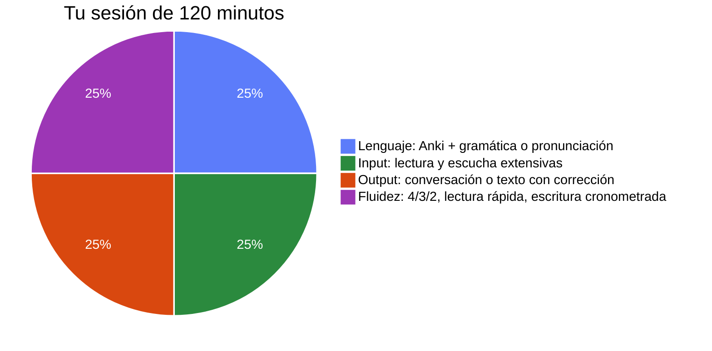
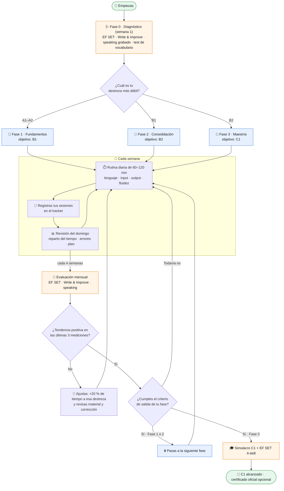
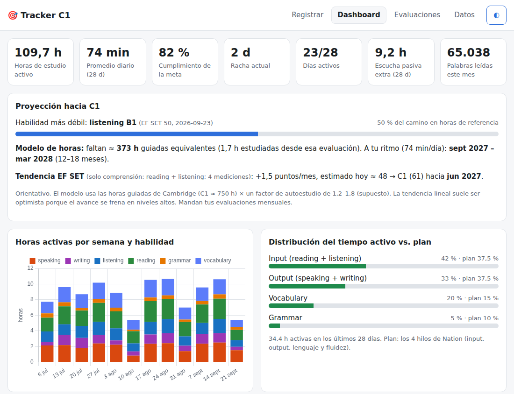

<div align="center">

# 🎯 English Study Fast

**De tu nivel actual a C1 en inglés, con métodos respaldados por la ciencia, materiales 100 % gratuitos y un progreso que puedes medir.**


</div>

> **En 30 segundos:** estudia 1–2 h al día repartidas en **4 bloques iguales** (input, output, lenguaje y fluidez), repasa vocabulario con **Anki**, habla y escribe **con corrección** y **mide tu nivel cada 4 semanas**. Con 1,5 h/día, el paso de B1 a C1 se estima en **~9–15 meses**. Todo lo que necesitas es gratis y está en este repositorio.

## 📌 Contenido

1. [¿Para quién es?](#-para-quién-es)
2. [La metodología en una imagen](#-la-metodología-en-una-imagen)
3. [Cómo se aplica: diagrama de flujo](#️-cómo-se-aplica-diagrama-de-flujo)
4. [Hoja de ruta por fases](#️-hoja-de-ruta-por-fases)
5. [¿Cuánto tiempo me tomará?](#️-cuánto-tiempo-me-tomará)
6. [Empieza hoy: tu primera semana](#-empieza-hoy-tu-primera-semana)
7. [Mide tu progreso](#-mide-tu-progreso)
8. [Qué dice la evidencia](#-qué-dice-la-evidencia)
9. [Qué hay en el repositorio](#-qué-hay-en-el-repositorio)
10. [Límites y supuestos](#️-límites-y-supuestos)
11. [Preguntas frecuentes y glosario](#-preguntas-frecuentes)

---

## 🧭 ¿Para quién es?

| ✅ Es para ti si… | ❌ No es… |
|---|---|
| Hablas español y quieres llegar a **C1** en las 5 áreas: *speaking, writing, listening, reading* y *grammar* | Un curso con profesor ni una app |
| Puedes dedicar **1–2 horas al día** de forma constante | Una promesa de "inglés en 30 días" |
| Prefieres técnicas **con evidencia** a las modas | Un sustituto de un certificado oficial |
| No sabes tu nivel, o sí: el plan empieza con un **diagnóstico** | Un plan cerrado: se ajusta con tus datos |

---

## 🔬 La metodología en una imagen

Tu tiempo se reparte a partes iguales entre los **4 hilos de Nation (2007)**, un marco clásico de la enseñanza de idiomas. Así sería una sesión de 120 minutos:



| Hilo | Qué haces | Por qué funciona |
|---|---|---|
| 🔧 **Lenguaje** | Anki con FSRS (20′), gramática o pronunciación (10′) | Repasar de forma **espaciada** y **recordando** supera a releer: g = 0,50 (Rowland, 2014) |
| 🎧 **Input** | Lees y escuchas material que entiendes al 95–98 % | La lectura extensiva mejora comprensión, velocidad y vocabulario: d = 0,57 (Jeon & Day, 2016) |
| 🗣️ **Output** | Conversas o escribes, **recibes corrección** y reescribes | La retroalimentación correctiva tiene un efecto medio y duradero: d ≈ 0,6 (Li, 2010) |
| ⚡ **Fluidez** | Repites y aceleras lo que ya sabes (4/3/2, lectura rápida) | Repetir con presión de tiempo reduce las pausas y sube la velocidad (Nation, 1989) |

> 💡 **La escucha en tiempo muerto** (bus, cocina, gimnasio) es un **extra**: súmala como *pasiva*, pero no cuenta para tu meta diaria.

---

## 🗺️ Cómo se aplica: diagrama de flujo



---

## 🛤️ Hoja de ruta por fases

| Fase | De → a | En qué te enfocas | Duración a 1,5 h/día | Pasas de fase cuando… |
|---|---|---|---|---|
| **0 · Diagnóstico** | — | Medir tu punto de partida | 1 semana | Tienes tu línea base registrada |
| **1 · Fundamentos** | A1/A2 → B1 | 3.000 palabras frecuentes, gramática base, pronunciación | 5–7 meses desde A2 | EF SET ≥ 41 · Write & Improve ≥ B1 · speaking ≥ B1 (2 min seguidos) |
| **2 · Consolidación** | B1 → B2 | Colocaciones, 100.000 palabras leídas al mes, conversación semanal | 5–7 meses | EF SET ≥ 51 · Write & Improve ≥ B2 · speaking ≥ B2 (20 min sin pasar al español) |
| **3 · Maestría** | B2 → C1 | Vocabulario académico, textos formales, simulacros de examen | 5–8 meses | C1 en EF SET 4-skill · simulacro aprobado · rúbricas en C1 dos veces seguidas |

📖 Detalle de cada fase, rutinas de 60 y 120 min y plantilla semanal: **[`plan/plan_de_estudio.md`](plan/plan_de_estudio.md)**

---

## ⏱️ ¿Cuánto tiempo me tomará?

Meses estimados hasta C1 según tu nivel inicial y tu dedicación diaria de estudio **activo**:

| Nivel inicial | 1 h/día | 1,5 h/día | 2 h/día |
|---|---|---|---|
| A1 | 25–39 | 17–26 | 12–20 |
| A2 | 22–34 | 14–23 | 11–17 |
| B1 | 14–23 | **9–15** | 7–12 |
| B2 | 7–12 | 5–8 | 3–6 |

<details>
<summary><b>¿De dónde salen estas cifras?</b></summary>

```
meses = (horas guiadas de C1 − horas de tu nivel) × factor de autoestudio ÷ horas de estudio al mes
```

- **Horas guiadas de referencia (Cambridge):** A2 190 · B1 375 · B2 550 · C1 750.
- **Factor de autoestudio 1,2–1,8:** es un **supuesto**. Se ancla de forma aproximada en la FSI del gobierno de EE. UU., cuyos cursos para llegar a un nivel profesional (≈ C1) en idiomas cercanos al inglés, como el español, suman clases y estudio autónomo ≈ 1,3–1,7 veces esas 750 h.
- Es una **estimación orientativa**, no una promesa. El tracker la recalcula con tu ritmo y tus resultados reales. Más detalle en la [§9 de la investigación](research/investigacion_profunda.md#9-modelo-de-tiempos-y-nivel-de-confianza).
</details>

---

## 🚀 Empieza hoy: tu primera semana

- [ ] **Día 1:** haz el [EF SET 50](https://www.efset.org/ef-set-50/) (50 min) y registra tu puntaje.
- [ ] **Día 2:** escribe un texto en [Write & Improve](https://writeandimprove.com/) y graba **2 min hablando en inglés + 1 min en español** ([protocolo](tracker/rubricas.md#1-speaking-grabado-cada-4-semanas)).
- [ ] **Día 3:** haz el [test de vocabulario](https://www.lextutor.ca/tests/vst/) y la [autoevaluación MCER](https://europass.europa.eu/system/files/2020-05/CEFR%20self-assessment%20grid%20EN.pdf).
- [ ] **Día 3:** instala [Anki](https://apps.ankiweb.net/), activa **FSRS** y descarga un mazo de palabras frecuentes.
- [ ] **Día 4:** elige tu fase con la [tabla del plan](plan/plan_de_estudio.md#fase-0-diagnóstico-semana-1-34-h-en-total) y prepara tus materiales: un *graded reader* y un podcast ([catálogo gratuito](resources/materiales_gratuitos.md)).
- [ ] **Días 4 a 7:** sigue la rutina de 60 o 120 min y registra cada sesión.
- [ ] **Domingo:** haz tu primera revisión semanal en el dashboard.

---

## 📊 Mide tu progreso

Abre **`tracker/index.html`** con doble clic: funciona sin instalar nada y sin internet. Si prefieres la terminal, usa **`tracker/progress.py`**. Las dos herramientas comparten los mismos archivos CSV.



| Qué mide | Para qué te sirve |
|---|---|
| ⏱️ Minutos activos, racha y días activos | Ver tu **constancia**, el factor que más pesa |
| 🥧 Reparto del tiempo frente al plan | Detectar si te falta input, output o te sobra Anki |
| 📈 Nivel MCER por habilidad | Seguir tu evolución con pruebas externas |
| 🎯 Proyección hacia C1 | Estimar la fecha a tu ritmo real y ver tu tendencia en EF SET |
| 🔔 Alertas y recordatorios | Saber cuándo toca evaluarte y qué corregir |

```bash
python tracker/progress.py add reading 30 "Graded reader" --cantidad 3500 --unidad palabras
python tracker/progress.py test "EF SET 50" general --puntaje 52     # el MCER (B2) se deduce solo
python tracker/progress.py                                            # reporte en tracker/reporte.md
```

📖 Guía completa: **[`tracker/README.md`](tracker/README.md)** · Rúbricas y protocolos: **[`tracker/rubricas.md`](tracker/rubricas.md)**

---

## 🧪 Qué dice la evidencia

| Técnica | Qué encontraron los estudios | Confianza |
|---|---|---|
| Repetición espaciada | Efecto medio-grande en el aprendizaje de vocabulario L2 (Kim & Webb, 2022) | 🟢 Alta |
| Recordar en vez de releer | g = 0,50 en 159 comparaciones (Rowland, 2014) | 🟢 Alta |
| Lectura extensiva | d = 0,57; efecto mayor cuando rindes cuentas de lo que lees (Jeon & Day, 2016; Sangers et al., 2025) | 🟢 Alta |
| Gramática explícita | Supera a la implícita: d ≈ 1,13 frente a 0,54 (Norris & Ortega, 2000) | 🟢 Alta |
| Corrección de errores | Efecto medio y duradero; mejor si intentas autocorregirte (Li, 2010; Lyster & Saito, 2010) | 🟢 Alta |
| Pronunciación | Efecto grande, d ≈ 0,8–0,9 (Lee, Jang & Plonsky, 2015) | 🟢 Alta |
| Shadowing | Mejora la inteligibilidad, la fluidez y la entonación en 44 estudios (Whitworth & Rose, 2025) | 🟡 Moderada |
| Chatbots de IA | Más fluidez y menos ansiedad, en estudios recientes y cortos (Du & Daniel, 2024) | 🟠 Baja-moderada |
| "Estilos de aprendizaje" | Sin evidencia suficiente para organizar el estudio así (Pashler et al., 2008; metaanálisis de 2024) | ❌ Evítalo |

> ⚠️ Los tamaños de efecto vienen de estudios con medidas distintas: **no se pueden sumar** ni convertir en "meses ahorrados".

📖 Investigación completa, con 18 metaanálisis, 3 revisiones sistemáticas, contradicciones y matriz de confianza: **[`research/investigacion_profunda.md`](research/investigacion_profunda.md)**

---

## 📁 Qué hay en el repositorio

```
English_study_fast/
├── README.md                          ← estás aquí
├── research/investigacion_profunda.md ← la evidencia: qué funciona, cuánto y con qué confianza
├── plan/plan_de_estudio.md            ← fases, rutinas de 60/120 min, criterios y reglas de ajuste
├── resources/materiales_gratuitos.md  ← 50+ recursos gratis por destreza, con prompts para IA
├── tracker/                           ← web app + script Python + rúbricas + datos de ejemplo
└── docs/img/                          ← imágenes de este README
```

---

## ⚠️ Límites y supuestos

- **El plan es una síntesis:** cada técnica tiene evidencia, pero la combinación completa no se ha probado en un ensayo controlado.
- **Los tiempos dependen de un supuesto** (el factor de autoestudio) y, sobre todo, de tu **constancia**.
- **Toda medición tiene error:** decide con la tendencia de 3 o más mediciones, nunca con un solo dato.
- **EF SET es útil para el seguimiento**, pero no sustituye un certificado oficial (C1 Advanced, IELTS o TOEFL) si lo necesitas para estudiar o migrar.
- **Los recursos gratuitos cambian:** los marcados con ○ en el catálogo no se pudieron verificar en la investigación.

---

## ❓ Preguntas frecuentes

<details>
<summary><b>¿Tengo que pagar algo?</b></summary>

No. Todo el plan funciona con recursos gratuitos. La única excepción habitual es Anki en iPhone (de pago): usa AnkiWeb en el navegador o la versión gratuita de Android o escritorio.
</details>

<details>
<summary><b>¿Qué hago si fallo varios días seguidos?</b></summary>

Vuelve con la rutina mínima de 60 min, sin intentar "recuperar" el tiempo perdido. Un día corto vale más que un día saltado.
</details>

<details>
<summary><b>¿Sirven Duolingo y otras apps?</b></summary>

Como complemento, sí. No encontré evidencia independiente de que una app gamificada lleve sola a C1. El plan usa apps para piezas concretas (Anki, práctica de pronunciación).
</details>

<details>
<summary><b>¿Puedo usar ChatGPT, Claude u otra IA?</b></summary>

Sí, para **practicar**: conversar y recibir corrección de tus textos (hay prompts en el [catálogo](resources/materiales_gratuitos.md)). No, para **medir tu nivel**: sus estimaciones de nivel MCER no están validadas. Para medir, usa las pruebas del tracker.
</details>

<details>
<summary><b>¿Por qué 4 bloques y no "solo input" o "solo gramática"?</b></summary>

Cada tipo de práctica mejora cosas distintas. El input solo deja lagunas al hablar y escribir, y la gramática sola no da fluidez. Nation (2007) recomienda repartir el tiempo a partes iguales entre los cuatro hilos.
</details>

<details>
<summary><b>📖 Glosario</b></summary>

| Término | Qué significa |
|---|---|
| **MCER / CEFR** | Marco Común Europeo de Referencia: niveles A1 (inicial) a C2 (maestría). C1 = "dominio operativo eficaz" |
| **Input comprensible** | Lo que lees o escuchas entendiéndolo casi todo (95–98 % de las palabras) |
| **SRS / FSRS** | Repetición espaciada: repasar justo antes de olvidar. FSRS es el algoritmo moderno de Anki |
| **Graded reader** | Libro adaptado a un nivel de vocabulario concreto |
| **Shadowing** | Repetir en voz alta, casi a la vez, lo que escuchas |
| **4/3/2** | Contar lo mismo tres veces, en 4, 3 y 2 minutos, para ganar fluidez |
| **Horas guiadas** | Horas de clase o estudio supervisado que Cambridge estima para cada nivel |
| **Familia de palabras** | Una palabra y sus derivadas (*decide, decision, decisive*) |
| **Escucha pasiva** | Escuchar inglés mientras haces otra cosa: suma exposición, pero no es estudio activo |
</details>

<details>
<summary><b>✅ Cómo aplica este README las 7 C de la comunicación</b></summary>

| C | Cómo se aplicó |
|---|---|
| **Clara** | Frases cortas, términos técnicos explicados en el glosario y un solo objetivo por sección |
| **Concisa** | Resumen de 30 segundos arriba; el detalle queda en documentos enlazados y en secciones plegables |
| **Concreta** | Cifras, fechas, comandos y una checklist día a día en lugar de consejos genéricos |
| **Correcta** | Cada cifra sale de una fuente citada y verificada; los supuestos y límites se declaran |
| **Coherente** | Orden lógico: para quién → qué → cómo (diagrama) → cuánto → empezar → medir → evidencia → límites |
| **Completa** | Todo lo necesario para empezar hoy: diagnóstico, plan, materiales, medición y respuestas a dudas frecuentes |
| **Cortés** | Tono cercano y en segunda persona, sin promesas exageradas ni juicios sobre tu nivel |
</details>

---

<div align="center">

Hecho con evidencia, sin atajos mágicos. Si este plan te sirve, **empieza por el diagnóstico** y deja que tus datos te guíen. 🚀

<sub>Las gráficas del tracker usan <a href="https://www.chartjs.org/">Chart.js</a> (licencia MIT), incluido en <code>tracker/vendor/</code>.</sub>

</div>
